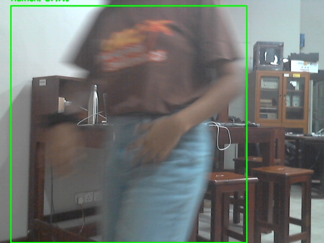
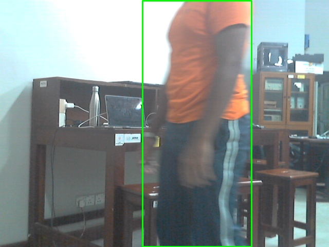
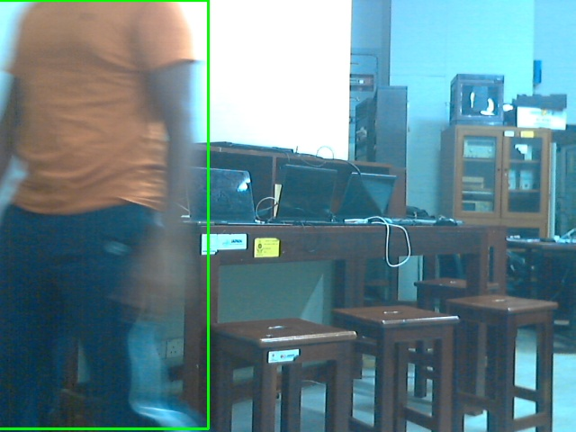

# Human Motion Detection using Raspberry Pi

This project uses a Raspberry Pi and a webcam to detect human motion in real-time. It utilizes the MobileNet SSD (Single Shot Multibox Detector) pre-trained deep learning model to identify human presence in video frames. When significant movement is detected, the system saves a screenshot of the scene with a timestamped filename.

Here are some screenshots of the motion detection system in action:

<div style="display: flex; justify-content: space-around;">
  
  
  
</div>
## Requirements

- Raspberry Pi (any model with a camera interface)
- USB Webcam or Raspberry Pi Camera Module
- Python 3.x
- OpenCV (cv2)
- NumPy

## Installation

### 1. Install Dependencies
Ensure that your Raspberry Pi is set up with the latest version of Python and necessary libraries. Install the required libraries via `pip`:

```bash
sudo apt update
sudo apt install python3-opencv
sudo apt install python3-numpy

```

### Download MobileNet SSD Model

The project uses the pre-trained MobileNet SSD model for detecting objects, particularly humans. You need to download the model files:

*   [MobileNet SSD Prototxt](https://github.com/chuanqi305/MobileNet-SSD/blob/master/deploy.prototxt)
    
*   [MobileNet SSD Caffe Model](https://github.com/chuanqi305/MobileNet-SSD/blob/master/mobilenet_iter_73000.caffemodel)
    

Place these files in the model directory of the project.

### 4\. Run the Script

Once everything is set up, run the Python script to start motion detection:

 ```bash
python3 motion_detection.py
 ```

The script will access the webcam, detect human motion, and save frames when significant movement is detected. The saved images will have filenames in the format motion\_YYYY-MM-DD\_HH-MM-SS.jpg.

### 5\. Exit the Program

To stop the program, press q while the window displaying the webcam feed is focused.

How It Works
------------

*   The script uses OpenCV's DNN module to load and use the MobileNet SSD model to detect humans in real-time.
    
*   When a human is detected, the system tracks the person's position in the video frame.
    
*   If there is significant movement (based on a pre-defined threshold), the frame is saved as a timestamped image.
    
*   The images are saved in the same directory with filenames like motion\_YYYY-MM-DD\_HH-MM-SS.jpg.

## Demo Video

Here is the demo video showing the motion detection system in action:

[Demo Video](demo.mp4)

Contributing
------------

Feel free to fork this project, make changes, and submit pull requests. If you find any bugs or issues, please open an issue in the GitHub repository.
